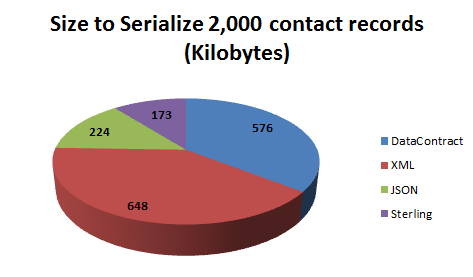
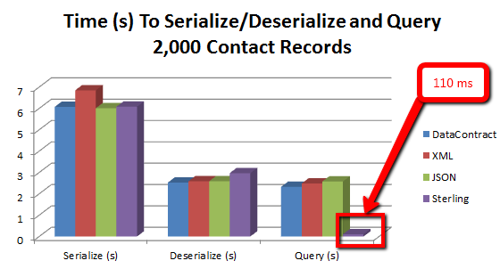

**Project Description**

Sterling is a lightweight NoSQL object-oriented database for .Net 4.0, Silverlight 4 and 5, and Windows Phone 7 that works with your existing class structures. 

The goal behind Sterling is to keep it: 
* Non-intrusive. You shouldn't have to change your classes just to persist them. (No awkward mapping from a class model to a relational database model).
* Lightweight. As of this writing, the DLL for Sterling is under 85 Kb. No one needs to bloat their project for something as simple as persisting data.
* Flexible. While the core is light, Sterling is designed to handle any serialization task and make it ultra-easy to query databases using LINQ-to-Objects.
* Portable. Sterling runs equally well on the desktop/server .NET framework, Silverlight, and Windows Phone.
View the full [Features](Features.md) list.

**Important Note from Jeremy Likness** 

Using Sterling comes with a trade-off. This product is maintained by a very small team - mostly Jeremy Likness with some assistance - so there is no guaranteed turnaround time for bug-fixes and there is no support hotline. That is the risk: defects may exist, and there is no guaranteed resolution. The reward is an out-of-the-box tool that makes saving and serializing objects very fast, easy, and straightforward. To further remove any barriers to use, I purposefully make two decisions with this project: first, you have 100% uncompromised access to the source at no cost, and second, you have full rights to take the source, modify it, fix it, or use it however you see fit within your own projects, at your own risk, against with no charge. There is no commercial fee for this project. I hope that this risk/reward model works for you and I also look forward to anyone open to joining our team to help support this product through future releases. 

Thank you,


The current stable release is [release:102554](release_102554) . There is no current beta.

Read the [MSDN Article about Sterling](http://msdn.microsoft.com/en-us/magazine/hh205658.aspx). (The recipe example has been updated to 1.5 and the full source is provided in the download).

Listen to [Jeremy's interview with Jesse Liberty about Sterling](http://jesseliberty.com/2011/03/15/yet-another-podcast-28jeremy-lickness/)

Sterling is compact on disk. This is how the entire Sterling database (including indexes and table definitions) compares on disk to other popular serialization methods when saving 2,000 contact records:



Sterling is fast. The speed of serialization and deserialization is comparable to other methods despite the overhead of maintaining keys and indexes. The keys and indexes enable blazing fast LINQ to Object queries over Sterling records. In this example, the speed to serialize 2,000 contact records, deserialize them, then deserialize a subset of records based on a query to find all contacts with a last name starting with "L" is compared:



**Follow Sterling on Twitter**

Use the official Sterling tag: [#SterlingDB](http://twitter.com/#!/search/%23sterlingdb)

**Who's Using It?** 

Check out this [Discussion Thread](http://sterling.codeplex.com/Thread/View.aspx?ThreadId=245116) to read who is using Sterling and how. If you are using Sterling, please join the conversation and share the details of your project!

**The Sterling Team**

Sterling was conceived, designed, and developed by [Jeremy Likness](http://www.codeplex.com/site/users/view/jeremylikness). A Microsoft Silverlight MVP, Jeremy has been working with line of business web-based applications for 15 years. He is a project manager and consultant for [Wintellect](http://www.Wintellect.com/). Contact Jeremy on Twitter [@JeremyLikness](http://twitter.com/JeremyLikness) and visit his blog [C#er : IMage](http://csharperimage.jeremylikness.com).

The Sterling logo was contributed by Wintellect consultant [Page Brooks](http://pagebrooks.com) ([@PBrooks](http://www.twitter.com/pbrooks)).

Several Sterling contributions have been made from the community, including [kallocain](http://www.codeplex.com/site/users/view/kallocain), [MDMiller](http://www.codeplex.com/site/users/view/MDMiller), and [Faz](http://www.codeplex.com/site/users/view/Faz), [baxevanis](http://www.codeplex.com/site/users/view/baxevanis) (if you've contributed and I overlooked your name, let me know and I'll include it here!)

Sterling contributors who have joined the development team are: 

* Steven Pears, a UK Developer working on .NET applications and websites in the construction industry.
* [Don Reamey](http://www.codeplex.com/site/users/view/donre), a Software Development Engineer with Microsoft working on SharePoint Online which is part of Office 365. Prior to that he worked on InfoPath Forms Service and Information Bridge Framework. He spent 10+ years in the financial industry working on capital markets financial software. Read [Don's blog](http://blogs.officezealot.com/dreamey).
* [Federico Degrandis](http://www.codeplex.com/site/users/view/federicoD), a Microsoft Student Partner at the Bicocca University in Milan, Italy where he collaborates with two research laboratories and holds seminars on Microsoft technologies within the university. He works for Euery Software as software developer. Visit [Federico's website](http://www.dexterblogengine.com/Federico-Degrandis.ashx). 

[Michael Washington](http://www.codeplex.com/site/users/view/adefwebserver) is the Sterling editor and has contributed many tutorials and articles. He is a website developer and an ASP.NET, C#, and Visual Basic programmer. Michael is a Microsoft Silverlight MVP. Visit [Michael's website](http://adefwebserver.com). 

**This is YOUR database so we want to add the features you need the most! Visit the [Issue Tracker](http://sterling.codeplex.com/workitem/list/basic) to view, vote for and add your own feature requests!**

**I Want Details!**

In short, here's all it takes to define a table with an integer key and a string index: 

```C#
protected override List<ITableDefinition> RegisterTables()
{
   return new List<ITableDefinition>
      {   CreateTableDefinition<MyContact, int>(c => c.Id)
                               .WithIndex<MyContact, string, int>("Contact_Email", c => c.Email)
      };
}
```

Note the indexes always contain the key. This is because Sterling will lazy-load the actual entity. You can query over indexes and keys using LINQ to Objects, and only de-serialize when you need the value.

Here is an example of a complex query from the reference application:

```C#
return from n in CurrentFoodDescription.Nutrients
        join nd in
            SterlingService.Current.Database.Query<NutrientDefinition, string, string, int>(
                FoodDatabase.NUTR_DEFINITION_UNITS_DESC)
            on n.NutrientDefinitionId equals nd.Key
        join nd2 in
            SterlingService.Current.Database.Query<NutrientDefinition, int, int>(
                FoodDatabase.NUTR_DEFINITION_SORT)
            on nd.Key equals nd2.Key
        orderby nd2.Index
        select new NutrientDescription
                    {
                        Amount = n.AmountPerHundredGrams,
                        Description = nd.Index.Item2,
                        UnitOfMeasure = nd.Index.Item1
                    };
```

To learn more, read the full [Sterling User's Guide](https://sites.google.com/site/sterlingdatabase/).
